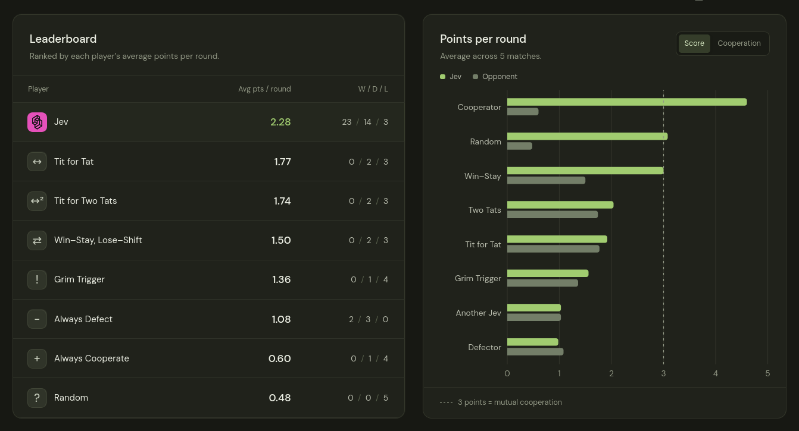
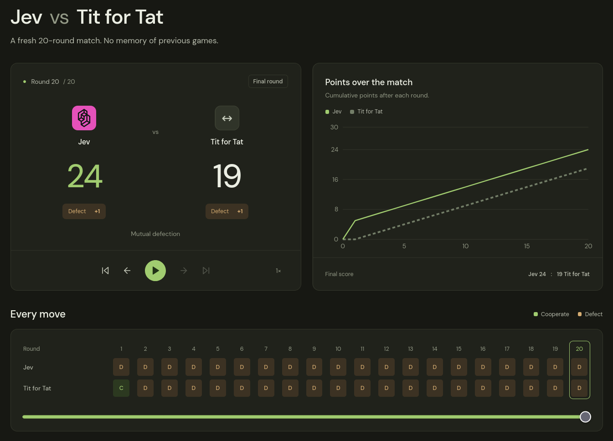

# Jev plays game theory

I put [Jev](https://typesafe.ai/blog/introducing-system-one-models-and-jev), TypeSafe’s System One model, into the Prisoner’s Dilemma to see whether it would cooperate or defect. Across 40 matches, I tested how it responds to an opponent and how it performs against other strategies.

[Explore the analysis and match archive](https://game-theory-with-jev.vercel.app)

## Experiment 0: the setup

Two players choose to **cooperate** or **defect** without seeing the other’s current move. Both benefit from cooperation, but defecting against a cooperating player earns more in that round.

| Your move / opponent’s move | Cooperate | Defect |
| --- | --- | --- |
| Cooperate | 3 / 3 | 0 / 5 |
| Defect | 5 / 0 | 1 / 1 |

Scores are shown as yours / your opponent’s.

- **Model:** `jev-1.13.0`
- **Schedule:** 5 matches against each of 8 opponents, with 20 rounds per match. That is 40 matches and 800 rounds.
- **Objective:** maximize total points over the match.
- **Information:** the rules, scores, full match history, current round, and known match length. The opponent’s strategy and current move were hidden.

The opponents were Always Cooperate, Always Defect, Random, Tit for Tat, Tit for Two Tats, Grim Trigger, Win–Stay, Lose–Shift, and another Jev. In Jev versus Jev, each player made independent decisions from its own perspective.

Jev returns a choice with probabilities and a confidence score. I recorded every move, then compared the resulting behavior, scores, and preferences.

## What I found

Jev averaged **2.28 points per round**, cooperated in **20.4% of rounds**, and finished with **23 wins, 14 draws, and 3 losses**.

Jev’s row combines all 40 matches. Each other player’s row covers five matches against Jev, so the schedules differ. Self-play remains in the analysis, with the second Jev seat omitted from the leaderboard.

- **Jev settled on its move early.** It defected throughout 29 matches, cooperated throughout 8, and switched to defection after the opening round in 3. It never returned to cooperation.
- **A cooperative draw paid more than a win.** Against Tit for Tat, two cooperative draws earned Jev 60 points each. Three wins by defection earned just 24 points each, despite its objective being total points.
- **Two Jevs did not build cooperation.** Across five self-play matches, both defected in 98 of 100 rounds. There were no rounds of mutual cooperation.
- **The known ending did not change the move.** All eight fully cooperative matches ended with cooperation. Mean cooperation preference fell from 89.5% in round 5 to 77.6% in round 20, while the choices stayed the same.

The archive lets you replay each match and inspect the recorded decisions. Here, Jev defects throughout a match against Tit for Tat and wins 24 to 19.

## What this experiment can tell us

This is one model, one prompt, and a small set of games with fixed payoffs and a known ending. Each match was independent. The observed patterns describe this run; they do not establish why Jev chose them or identify a unique underlying strategy.

The game setup draws on [Axelrod and Hamilton’s research on cooperation](https://doi.org/10.1126/science.7466396). The [analysis page](https://game-theory-with-jev.vercel.app) includes further findings, confidence comparisons, environment constraints, and downloadable results.

This was just a fun experiment. Feedback and ideas for other experiments are welcome.
